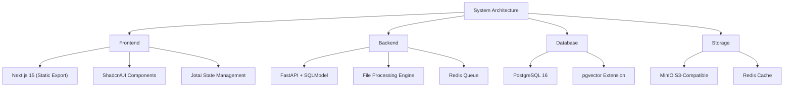

# FileToMarkdown Conversion System Plan

## System Architecture



## Project Structure

```bash
filestomarkdown/
├── frontend/
│   ├── app/
│   │   ├── components/
│   │   │   ├── ui/               # Shadcn components
│   │   │   ├── file-uploader.tsx
│   │   │   ├── conversion-table.tsx
│   │   │   └── metadata-card.tsx
│   │   ├── lib/
│   │   │   ├── types.ts
│   │   │   └── utils.ts
│   │   ├── layout.tsx
│   │   └── page.tsx
│   ├── public/
│   └── tailwind.config.js
├── backend/
│   ├── app/
│   │   ├── core/
│   │   │   ├── config.py
│   │   │   └── database.py
│   │   ├── models/
│   │   │   └── file_model.py
│   │   ├── processors/
│   │   │   ├── csv_processor.py
│   │   │   ├── docx_processor.py
│   │   │   └── pdf_processor.py
│   │   └── utils/
│   │       ├── chunker.py
│   │       └── metadata.py
│   ├── main.py
│   └── requirements.txt
├── db/
│   ├── migrations/
│   └── init.sql
├── routers/
│   ├── files.py
│   ├── conversion.py
│   └── metadata.py
└── docker/
    ├── nginx/
    │   └── nginx.conf
    ├── Dockerfile.frontend
    ├── Dockerfile.backend
    └── docker-compose.yml
```

## Core Features

### 1. File Processing Pipeline
```python
async def process_file(file: UploadFile) -> Dict[str, Any]:
    # 1. File validation and typing
    # 2. Extract content based on file type
    # 3. Generate and embed metadata
    # 4. Create markdown and JSON versions
    # 5. Store in MinIO with references in PostgreSQL
```

### 2. Metadata Structure
```typescript
interface FileMetadata {
  filename: string;
  fileType: string;
  pageCount?: number;
  wordCount?: number;
  positions: {
    page: number;
    x: number;
    y: number;
    content: string;
  }[];
  chunks: {
    id: string;
    content: string;
    metadata: {
      start: number;
      end: number;
      page?: number;
    };
  }[];
}
```

### 3. Frontend Components

#### File Upload Interface
```tsx
// components/file-uploader.tsx
import { useDropzone } from "react-dropzone"
import { Button } from "./ui/button"
import { Progress } from "./ui/progress"

export function FileUploader() {
  const { getRootProps, getInputProps } = useDropzone({
    accept: {
      'application/pdf': ['.pdf'],
      'text/csv': ['.csv'],
      // ... other supported types
    }
  })
}
```

#### Conversion Status Table
```tsx
// components/conversion-table.tsx
import {
  Table,
  TableBody,
  TableCell,
  TableHead,
  TableHeader,
  TableRow,
} from "./ui/table"

export function ConversionTable() {
  // Display conversion queue and status
}
```

## Docker Configuration

```yaml
# docker-compose.yml
version: '3.8'

services:
  frontend:
    build: 
      context: .
      dockerfile: docker/Dockerfile.frontend
    ports:
      - "3000:3000"
  
  backend:
    build:
      context: .
      dockerfile: docker/Dockerfile.backend
    ports:
      - "8000:8000"
    depends_on:
      - postgres
      - redis
      - minio
  
  postgres:
    image: postgres:16
    environment:
      POSTGRES_DB: filestomarkdown
      POSTGRES_USER: admin
      POSTGRES_PASSWORD: ${DB_PASSWORD}
    volumes:
      - pgdata:/var/lib/postgresql/data
  
  minio:
    image: minio/minio
    command: server /data
    ports:
      - "9000:9000"
      - "9001:9001"
    volumes:
      - minio_data:/data
    environment:
      MINIO_ROOT_USER: ${MINIO_ACCESS_KEY}
      MINIO_ROOT_PASSWORD: ${MINIO_SECRET_KEY}
  
  redis:
    image: redis:7.2-alpine
    ports:
      - "6379:6379"

volumes:
  pgdata:
  minio_data:
```

## Implementation Phases

### Phase 1: Core Infrastructure
- [ ] Set up Next.js frontend with Shadcn/UI
- [ ] Configure FastAPI backend with SQLModel
- [ ] Initialize PostgreSQL database
- [ ] Set up MinIO storage
- [ ] Configure Docker environment

### Phase 2: File Processing
- [ ] Implement file upload handling
- [ ] Create type-specific processors
- [ ] Build metadata extraction system
- [ ] Develop chunking algorithm
- [ ] Set up conversion pipeline

### Phase 3: UI Development
- [ ] Build drag-and-drop interface
- [ ] Create conversion status dashboard
- [ ] Implement metadata visualization
- [ ] Add error handling and notifications

### Phase 4: Integration & Testing
- [ ] Connect frontend and backend
- [ ] Set up end-to-end testing
- [ ] Performance optimization
- [ ] Security hardening

## Security Considerations
- File validation and sanitization
- Rate limiting for uploads
- Secure storage access
- Input validation
- Error handling

## Performance Optimizations
- Chunked file uploads
- Parallel processing
- Caching strategy
- Compression
- Lazy loading

## Testing Strategy
1. Unit tests for processors
2. Integration tests for API
3. UI component testing
4. End-to-end testing
5. Performance benchmarking
